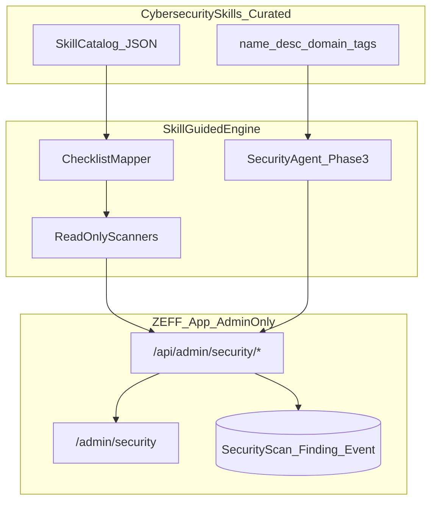

# PRD: ZEFF AI 인앱 Security Program (스킬 기반)

| Field | Value |
|-------|--------|
| **Product / Feature** | ZEFF Security Program — 인앱 보안 운영·점검·가이드 시스템 |
| **Status** | Phase 1–3 implemented (admin-only) |
| **Author** | Product / Cursor agent |
| **Stakeholders** | Product owner, engineering, ops |
| **Date Created** | 2026-07-24 |
| **Version** | 1.1 |
| **Depends on** | Anthropic Cybersecurity Skills pack (~817, `~/.agents/skills`), [PRD_SECURITY_HARDENING_2026-07](./PRD_SECURITY_HARDENING_2026-07.md) |
| **Code name** | `zeff-sec` |

---

## 1. Executive Summary

**One-liner:** ZEFF AI 앱 안에 **관리자 전용** 보안 콘솔·스캔·에이전트를 두어, 설치된 사이버보안 스킬을 “지식 엔진”으로 쓰는 상시 보안 프로그램.

**Overview:**  
이미 설치된 Cybersecurity Skills(약 800+)는 Cursor/에이전트용 지침이다. 이를 그대로 외부 공격 도구로 돌리는 것이 아니라, **방어·점검·교육용으로 큐레이션**해 앱 내부 Security Program에 연결한다.

**권한 원칙 (v1.1 확정):** Security Program의 **모든 화면·API·설정·스캔·스킬 카탈로그·에이전트**는 **관리자(`isAdminSession` / `ADMIN_EMAILS`)만** 접근·변경할 수 있다. 일반 사용자에게는 노출하지 않는다.

제품은 두 층으로 구성한다.

1. **Security Ops Console (관리자 전용)** — `/admin/security` 및 하위 설정  
2. **Skill-Guided Engine (서버, 관리자 API만)** — 스킬 카탈로그 + 체크리스트 스캔 + (후속) 보안 에이전트  

> **참고 (범위 밖):** 설정 > 보안 탭의 비밀번호·2FA·기기 로그아웃은 **본인 계정 셀프서비스**이며 Security Program이 아니다. 이번 PRD에서 바꾸거나 관리자 전용으로 옮기지 않는다.

**이번 PRD 기본 결정(승인 시 확정):**

| 질문 | 기본값 |
|------|--------|
| 접근 권한 | **관리자만** (일반 사용자 UI/API 없음) |
| 1차 능력 | **단계 출시**: 대시보드 → 스캔 → 에이전트 |
| 스킬 활용 | **웹앱/API/인증/클라우드 방어 도메인만 큐레이션** (공격·악성코드 실행 스킬은 UI에서 제외) |
| 실행 방식 | 서버사이드 **읽기 전용 점검 + 리포트**. Exploit PoC·임의 호스트 공격 금지 |

**Quick Facts:**
- **Target users:** 관리자(운영)만  
- **Problem solved:** 보안이 “한 번 패치하고 끝”이 됨. 스킬·감사 결과가 제품에 남지 않음  
- **Key metric:** 주간 보안 스캔 실행률, Critical/High open 건수 추이  
- **MVP target:** Phase 1 (대시보드 + 체크리스트) 1 sprint |

---

## 2. Problem Statement

### The Problem
- 보안 하드닝은 코드로 반영됐지만, **앱 안에서 상태를 보고·재점검·추적**하는 프로그램이 없다.
- 800+ 스킬은 로컬 에이전트에만 있고, 제품 UX/운영 루프에 연결되지 않았다.
- 관리자는 의존성 CVE·설정 drift·감사 이벤트를 한 화면에서 보기 어렵다.
- 보안 프로그램 설정이 일반 사용자에게 열리면 운영 통제·스킬/리포트 유출 위험이 생긴다.

### Current State
- 관리: `/admin` (회원·주문·문의·AI)
- 사용자: 설정 > 보안 (`SecurityPanel` — 비밀번호, 2FA, logout-all, 최근 로그인)
- 스킬: `~/.agents/skills` (전역), 앱 DB/UI와 무관
- 하드닝 PRD는 구현 완료(세션/OTP/CSP/문의 로그인 등)

### Impact
- 재발·회귀를 조기에 못 잡음  
- 스킬 투자가 제품 가치로 전환되지 않음  
- 운영/컴플라이언스 질문에 “문서/채팅 기록”으로만 답해야 함  

### Why Now
하드닝 직후 상태를 **상시 프로그램**으로 고정할 최적 시점. 스킬 팩이 이미 설치됨.

---

## 3. Goals & Objectives

### Goals
1. 관리자가 **한 화면**에서 보안 상태(점수, Critical/High, 최근 이벤트)를 본다.
2. **스킬 기반 체크리스트 스캔**을 실행하고, 결과를 DB에 저장·비교한다.
3. Security Program **설정·스캔·카탈로그·에이전트는 관리자만** 사용한다 (비관리자 403).
4. (Phase 3) 관리자가 **보안 에이전트**에게 “우리 앱 OTP 정책 괜찮은가?”를 물어 스킬 근거로 답한다.

### Non-goals
- 일반 사용자용 Security Program UI / 보안 점수 / 스캔 API  
- 외부 타깃에 대한 침투 테스트 / Exploit / 악성코드 실행  
- 817개 스킬을 모두 UI에 노출하거나 전부 자동 실행  
- SIEM/SOAR 대체, 고객 SaaS용 MSSP  
- Cursor 스킬 파일을 브라우저에 그대로 노출(지적재산·공격 기법 유출 방지)  
- 사용자 본인 비밀번호·2FA UI를 관리자 전용으로 이전 (기존 셀프서비스 유지)

---

## 4. Personas

| Persona | Jobs-to-be-done |
|---------|-----------------|
| **Admin / Owner** | 보안 프로그램 설정·스캔·Finding·스킬 카탈로그·에이전트 전부 운영 |
| **End user** | Security Program **접근 불가**. (별도로 본인 비밀번호/2FA만 설정 탭에서 관리) |

---

## 5. Product Concept — “스킬을 어떻게 쓰는가”



### 큐레이션 규칙
스킬 카탈로그에 **포함**하는 태그/도메인 예:
- `web-application-security`, `api-security`, `authentication`, `oauth2`, `jwt`, `owasp`, `sensitive-data`, `access-control`, `cloud` (감사·설정), `incident` (대응 가이드)

**제외** (앱 실행/UI 금지):
- 자격증명 탈취·AD abuse·악성코드 분석 실행·공격용 페이로드 생성  
- 로컬 디스크 이미징·포렌식 도구 실행형 스킬  

카탈로그는 빌드 시 또는 관리자 “동기화”로 `skills.manifest.json` → DB `SecuritySkillRef` 로 적재한다. **SKILL.md 전문은 서버에만** 두고, 클라이언트에는 id·title·short description·mapped checks만 노출한다.

### 체크리스트 매핑 (예시)

| Check ID | 스킬 근거(예) | 앱 검사 |
|----------|---------------|----------|
| `auth.session_revoke_on_reset` | broken authentication / session mgmt | 코드 또는 runtime flag / smoke |
| `auth.otp_csprng` | API auth weaknesses | `otp.generateCode` 구현 해시/정적 규칙 |
| `http.csp_nonce` | XSS / CSP | response header 샘플 또는 config assert |
| `deps.npm_critical` | vuln triage | `npm audit --json` 서버 실행(관리자만) |
| `admin.env_allowlist` | access control | `ADMIN_EMAILS` 존재 여부 |
| `upload.auth_required` | sensitive data / BAC | inquiry route auth 규칙 |

검사는 **읽기 전용·자기 자신(self)** 만. 외부 URL 스캔 금지.

---

## 6. User Stories & Requirements

### Phase 1 — MVP: Security Ops Dashboard (Must, admin-only)

#### US-A0: 관리자 전용 접근 강제
**As an** operator,  
**I want** Security Program의 모든 라우트·API가 관리자만 통과하게,  
**So that** 일반 사용자가 보안 설정·스캔·리포트에 접근하지 못한다.

**Acceptance:**
- [ ] `/admin/security/**` 는 기존 admin layout 가드 + 페이지 내 `isAdminSession` 이중 확인
- [ ] `/api/admin/security/**` 는 모든 핸들러에서 `isAdminSession` 실패 시 **403**
- [ ] `/api/account/security/score` 등 사용자용 Security Program API **없음**
- [ ] 비관리자·미로그인으로 스캔/설정 변경 시도 시 성공하지 않음 (수동 또는 테스트)

#### US-A1: 관리자 보안 대시보드
**As an** admin,  
**I want** `/admin/security` 에서 점수·이슈 수·최근 스캔·권고를 보고,  
**So that** 배포 전에 상태를 한눈에 파악한다.

**Acceptance:**
- [ ] Admin nav에 **보안** 메뉴 추가
- [ ] 카드: Overall score (0–100), Open Critical/High/Med/Low, Last scan time, (선택) 2FA adoption % — **관리자만 표시**
- [ ] 최근 Finding 10건 테이블 (severity, title, status, checkId)
- [ ] 비관리자 403

#### US-A2: 체크리스트 스캔 실행
**As an** admin,  
**I want** “지금 스캔” 버튼으로 고정 체크리스트를 실행하고,  
**So that** 회귀를 자동으로 잡는다.

**Acceptance:**
- [ ] `POST /api/admin/security/scan` → `SecurityScan` + `SecurityFinding[]` 저장
- [ ] 최소 8개 이상 체크 (위 매핑 포함, 확장 가능)
- [ ] 동시 스캔 1개 (lock), rate limit
- [ ] 결과 UI에 pass/fail/warn + 권고 문구(한국어)
- [ ] 스캔은 **self-only**, 외부 호스트 금지
- [ ] 스캔 트리거·결과 조회는 **admin only**

#### US-A3: Finding 상태 관리
**As an** admin,  
**I want** Finding을 open / acknowledged / resolved / waived 로 바꾸고,  
**So that** 위험을 추적한다.

**Acceptance:**
- [ ] `PATCH /api/admin/security/findings/[id]`
- [ ] waived 시 reason 필수
- [ ] 감사 로그 `SecurityEvent` 기록

#### US-A7: 보안 프로그램 설정 (admin settings)
**As an** admin,  
**I want** `/admin/security/settings` 에서 스캔 알림·체크 토글·매니페스트 sync 등 프로그램 설정을 바꾸고,  
**So that** 운영 정책을 관리자만 통제한다.

**Acceptance:**
- [ ] 설정 UI는 `/admin/security/settings` 에만 존재 (사용자 설정 탭에 없음)
- [ ] 저장 API는 admin-only
- [ ] 변경 시 `SecurityEvent` 기록

---

### Phase 2 — Skill Catalog + Deeper Scanners (Should)

#### US-A4: 스킬 카탈로그 브라우즈
**As an** admin,  
**I want** 큐레이션된 스킬 목록(제목·도메인·연결 체크)을 보고,  
**So that** 어떤 지식으로 점검하는지 이해한다.

**Acceptance:**
- [ ] `/admin/security/skills` — 검색·태그 필터
- [ ] 스킬 본문(SKILL.md) 전문은 관리자 세션에서만, 또는 요약만
- [ ] “동기화” → 로컬/번들 매니페스트에서 메타 갱신

#### US-A5: npm audit / 헤더 / 환경 스캐너 강화
**As an** admin,  
**I want** 의존성·보안 헤더·필수 env 점검을 스캔에 포함하고,  
**So that** 하드닝 회귀와 CVE를 지속 추적한다.

**Acceptance:**
- [ ] `npm audit --json` 결과를 Finding으로 정규화 (Critical/High만 기본 노출, toggle로 Med)
- [ ] 샘플 요청 또는 설정 기반 CSP/`ADMIN_EMAILS`/Stripe webhook 시크릿 presence 체크
- [ ] 스캔 리포트 다운로드 (JSON/Markdown)

---

### Phase 3 — Security Agent (Could)

#### US-A6: 보안 에이전트 채팅
**As an** admin,  
**I want** `/admin/security/agent` 에서 질문에 대해 큐레이션 스킬 + 최근 스캔 결과를 근거로 답하고,  
**So that** 운영 판단을 빠르게 한다.

**Acceptance:**
- [x] 기존 AI 라우팅 재사용, **admin-only**, 별도 system prompt
- [x] 도구: `getLatestScan`, `listFindings`, `getSkillSummary(id)` — 읽기 전용
- [x] 거절: “다른 사이트 해킹해줘”, exploit PoC 요청
- [x] 답변에 스킬 id / finding id 인용 (시스템 프롬프트 + 도구 페이로드)

---

## 7. Information Architecture & UX

### Admin only
```
/admin/security              대시보드 + 스캔 실행
/admin/security/findings     전체 Finding
/admin/security/settings     프로그램 설정 (알림·체크 토글·sync)
/admin/security/skills       스킬 카탈로그 (Phase 2)
/admin/security/agent        보안 에이전트 (Phase 3)
/admin/security/scans/[id]   스캔 상세
```

### User (Security Program 해당 없음)
```
설정 > 보안 탭 — 본인 계정만 (비밀번호 / 2FA / logout-all / 최근 로그인)
※ Security Program 점수·스캔·설정·스킬 UI 없음
```

### Design notes
- 관리 콘솔 기존 DEV 헤더·nav 패턴 유지 (`admin/layout.tsx`)
- 심각도 색: Critical red / High orange / Med amber / Low slate
- 카드형 남용 금지: 대시보드는 요약 카드 소량 + 테이블 중심 (기존 admin과 조화)
- 모바일: 관리자 페이지는 데스크톱 우선 허용
- 모든 Security Program 페이지는 admin layout 밖에 두지 않음

---

## 8. Data Model (초안)

```prisma
model SecurityScan {
  id          String   @id @default(cuid())
  createdAt   DateTime @default(now())
  createdById String?
  status      String   // running | completed | failed
  score       Int?     // 0-100
  summaryJson Json?
  findings    SecurityFinding[]
}

model SecurityFinding {
  id          String   @id @default(cuid())
  scanId      String
  scan        SecurityScan @relation(...)
  checkId     String
  skillIds    String[] // mapped skill refs
  severity    String   // critical|high|medium|low|info
  title       String
  detail      String
  status      String   // open|acknowledged|resolved|waived
  waiveReason String?
  updatedAt   DateTime @updatedAt
}

model SecurityEvent {
  id        String   @id @default(cuid())
  createdAt DateTime @default(now())
  actorId   String?
  type      String   // scan_started|finding_updated|...
  payload   Json?
}

model SecuritySkillRef {
  id          String @id // skill folder name
  title       String
  description String
  domain      String?
  tags        String[]
  checkIds    String[]
  updatedAt   DateTime @updatedAt
}
```

(실제 스키마는 구현 시 Prisma에 맞게 조정.)

---

## 9. API (초안)

| Method | Path | Auth | 설명 |
|--------|------|------|------|
| GET | `/api/admin/security/overview` | admin | 점수·카운트·최근 스캔 |
| POST | `/api/admin/security/scan` | admin | 스캔 시작 |
| GET | `/api/admin/security/scans/[id]` | admin | 스캔 상세 |
| GET | `/api/admin/security/findings` | admin | 필터 목록 |
| PATCH | `/api/admin/security/findings/[id]` | admin | 상태 변경 |
| POST | `/api/admin/security/skills/sync` | admin | 카탈로그 동기화 |
| GET | `/api/admin/security/skills` | admin | 카탈로그 |
| GET/PATCH | `/api/admin/security/settings` | admin | 프로그램 설정 |
| POST | `/api/admin/security/agent` | admin | Phase 3 채팅 |

> 사용자용 `/api/account/security/score` 등은 **제공하지 않는다**.

---

## 10. Success Metrics

| Metric | Target (90일) |
|--------|----------------|
| 주간 관리자 스캔 ≥1회 실행한 주 | ≥ 80% |
| Open Critical Findings | 0 (또는 waived with reason) |
| Open High | 감소 추세 |
| 비관리자 Security Program API 성공률 | **0%** (전부 401/403) |
| 보안 에이전트 유용성 (admin 설문) | ≥ 4/5 (Phase 3) |

---

## 11. Scope

### In scope
- **Admin-only** Security Program UI/API/DB  
- 큐레이션 스킬 매니페스트 + 체크리스트 엔진  
- `/admin/security/settings` 프로그램 설정  
- Phase 2–3 백로그 정의  

### Out of scope
- 일반 사용자 Security Program / 보안 점수 UI  
- 공격형 스킬 실행, 타 시스템 침투  
- 고객이 임의 URL을 넣어 스캔하는 기능  
- 모바일 전용 보안 앱  
- 사용자 비밀번호·2FA를 관리자 콘솔로 이전  

---

## 12. Timeline & Milestones

| Phase | Deliverable | Estimate |
|-------|-------------|----------|
| **Phase 1** | DB + overview + scan(≥8 checks) + findings UI + admin settings (admin-only) | 3–5 days |
| **Phase 2** | Skill catalog sync/browse + npm/header/env scanners + export | 3–4 days |
| **Phase 3** | Security agent (read-only tools + refuse offensive) — **done** | 3–5 days |

**Phase 1–3 구현 완료 (admin-only).**

---

## 13. Risks & Mitigation

| Risk | Mitigation |
|------|------------|
| 스킬 본문/공격 기법 UI 유출 | 큐레이션 + 서버 전용 전문, 클라이언트 요약만 |
| npm audit이 빌드 환경에서 느림/실패 | 타임아웃, 캐시, 실패 시 warn Finding |
| 스캔 false positive | severity 조정 + waive + 문서화된 checkId |
| 관리자 잠금 (`ADMIN_EMAILS`) | 스캔 전 env 체크 + 대시보드 경고 배너 |
| AI 에이전트가 위험한 조언 | 시스템 프롬프트 거부 목록 + 도구 읽기 전용 |

---

## 14. Dependencies & Assumptions

- Admin = `ADMIN_EMAILS` / `isAdminSession`  
- Prisma + Neon 사용 가능, 마이그레이션 허용  
- 스킬은 서버가 읽을 수 있는 경로에 있거나, 배포 시 `data/security-skills.manifest.json` 으로 번들  
- Vercel 서버리스에서 `npm audit` 는 제약 가능 → Phase 2에서 **빌드 아티팩트/캐시** 또는 **별도 스크립트 업로드** 대안 허용  

---

## 15. Open Questions (승인 시 답 부탁)

1. Phase 1만 먼저 출시할지, Phase 1+2를 한 번에 할지? → **기본: Phase 1만 승인 후 구현**  
2. 스킬 매니페스트 소스: 로컬 `~/.agents/skills` 동기화 vs 레포 내 고정 번들? → **기본: 레포 번들(재현 가능) + 선택적 sync**  
3. ~~사용자 보안 점수?~~ → **취소.** Security Program은 **관리자만** (v1.1).  

---

## 16. Stakeholder Sign-Off

| Role | Decision | Date |
|------|----------|------|
| Product owner | Approve / Changes | |
| Engineering | Ready for Phase 1 | |

**승인 전에는 UI/API 구현에 착수하지 않는다.**

---

## Appendix A — Phase 1 Check Pack (고정)

1. `auth.session_revoke_on_reset`  
2. `auth.otp_uses_csprng`  
3. `auth.admin_emails_configured`  
4. `http.csp_present`  
5. `http.hsts_present` (prod)  
6. `upload.inquiry_requires_login`  
7. `cron.query_secret_disabled_in_prod`  
8. `deps.next_auth_min_version` (package.json 읽기)  

각 체크는 pass/fail/warn + remediation 한국어 문장 + 관련 skillIds(큐레이션 id)를 붙인다.

## Appendix B — Related docs

- [PRD_SECURITY_HARDENING_2026-07.md](./PRD_SECURITY_HARDENING_2026-07.md)  
- Admin layout: `src/app/admin/layout.tsx`  
- User security: `src/components/settings/SecurityPanel.tsx`  
