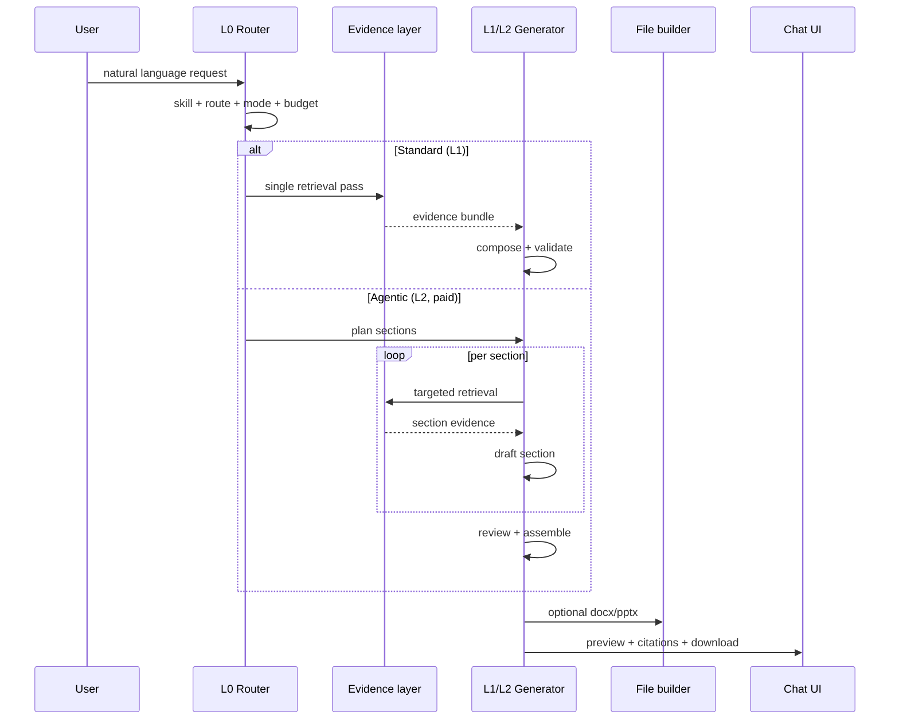

# Generative RAG Platform — Design Spec (Approach 3)

Companion to `docs/PRD_GENERATIVE_RAG_2026-07.md`.  
Supersedes `docs/superpowers/specs/2026-07-28-unified-rag-design.md` for product direction.

---

## 1. Design intent

**One orchestrator, many generation skills, shared evidence.**

The user speaks in natural language. The system produces **artifacts** (reports, decks, study packs) or **inline answers**, always grounded in retrievable evidence when claims are factual or comparative.

Approach 3 adds two layers on top of the prior unified-RAG router:

| Layer | Name | When |
|-------|------|------|
| L0 | Intent + source router | Every request |
| L1 | Standard Generate | Default; simple–medium complexity |
| L2 | Agentic Generate | Paid + high complexity |

---

## 2. Request lifecycle



---

## 3. L0 — Router contracts

### 3.1 Types

```ts
/** What the user ultimately receives */
type GenerationSkill =
  | "report"
  | "presentation"
  | "study"
  | "inline"; // compact chat answer, no file

type EvidenceRoute = "web_first" | "doc_first" | "hybrid";

type GenerationMode = "standard" | "agentic";

type AnswerFormat =
  | "compact_fact"
  | "explanatory"
  | "comparison"
  | "study_helper";

type OutputArtifact = "none" | "docx" | "pptx" | "study_pack";

type GenerativeRouteDecision = {
  skill: GenerationSkill;
  route: EvidenceRoute;
  mode: GenerationMode;
  answerFormat: AnswerFormat;
  artifact: OutputArtifact;
  freshnessRequired: boolean;
  needsPrivateSources: boolean;
  retrievalBudget: "free" | "paid";
  /** Optional mapping to existing tool id for composer reuse */
  toolId?: string;
};
```

### 3.2 Router inputs

| Input | Source |
|-------|--------|
| `query` | User message |
| `plan` | `free` \| `pro` \| `professional` from `userSettings` |
| `hasLibraryContext` | Whether workspace has indexed docs / attached files |
| `attachedFileIds` | Optional explicit attachments in message |

### 3.3 Router outputs (decision rules)

**Skill selection** (priority order):

1. Presentation signals → `presentation` (`intentTools` ppt patterns, slide/deck vocabulary)
2. Study signals → `study` (lecture, exam, practice, summarize for learning)
3. Report signals → `report` (report, minutes, weekly, research, analysis document)
4. Else → `inline`

**Evidence route:**

| Condition | Route |
|-----------|-------|
| User references own materials / attachments | `doc_first` or `hybrid` if also needs freshness |
| Freshness / public topic keywords | `web_first` |
| Compare user material to external | `hybrid` |
| Default for report/study on public topics | `web_first` |

**Mode selection:**

| Condition | Mode |
|-----------|------|
| `plan === "free"` | always `standard` |
| Short / single-topic / no “comprehensive” cues | `standard` |
| Long, multi-section, or explicit depth requests + paid | `agentic` |

**Artifact selection:**

| Skill | Default artifact |
|-------|------------------|
| `report` | `docx` (paid); `none` preview-only free |
| `presentation` | `pptx` (paid); outline preview free |
| `study` | `study_pack` or `docx` when export requested |
| `inline` | `none` |

### 3.4 Implementation location

- New: `src/lib/generativeRouter.ts` — superset of planned `ragRouter.ts`
- Bridge: call `detectQuickToolFromText` as a **signal**, not the sole decider
- Existing unified-RAG route types remain valid subsets of `EvidenceRoute`

---

## 4. Evidence layer

### 4.1 Shared evidence type

```ts
type EvidenceItem = {
  sourceType: "web" | "library" | "note";
  title: string;
  url: string; // https://... or library:chunkId
  snippet: string;
  score: number;
};

type EvidenceBundle = {
  web: EvidenceItem[];
  materials: EvidenceItem[];
  /** Flat list for composer prompt injection */
  all: EvidenceItem[];
};
```

### 4.2 Retrieval by route

| Route | Behavior |
|-------|----------|
| `web_first` | `searchWeb` → normalize → optional small library top-up |
| `doc_first` | library chunk search → optional web for definitions only |
| `hybrid` | parallel web + doc → `ragHybrid` merge/rerank |

Modules: `ragWeb.ts`, `ragSearch.ts`, `ragHybrid.ts`, `ragRerank.ts`, `ragMultiQuery.ts` (extend, do not replace).

### 4.3 Retrieval budgets

#### Free (trial)

```ts
{
  webCandidates: 3,
  docCandidates: 3,
  allowHybrid: false,
  maxCitations: 3,
  maxSections: 3,        // agentic N/A
  allowAgentic: false,
  allowFileExport: false // preview only
}
```

#### Pro

```ts
{
  webCandidates: 6,
  docCandidates: 6,
  allowHybrid: true,
  maxCitations: 6,
  maxSections: 8,
  allowAgentic: true,
  allowFileExport: true
}
```

#### Professional

```ts
{
  webCandidates: 10,
  docCandidates: 10,
  allowHybrid: true,
  maxCitations: 10,
  maxSections: 12,
  allowAgentic: true,
  allowFileExport: true
}
```

Store in `src/lib/generativeBudgets.ts` (may wrap `getRagBudget` from unified plan).

---

## 5. L1 — Standard Generate

### 5.1 Pipeline

```
decideGenerativeRoute(query, context)
  → retrieveEvidence(route, budget)
  → selectComposer(skill) → toolId / prompt template
  → buildComposerPrompt(query, evidenceBundle, skill)
  → model.generate
  → parseStructured / parseDeck / inline markdown
  → validate (structured parsers, pptValidate)
  → buildArtifact if allowed
  → return GenerativeResult
```

### 5.2 Composer mapping

| Skill | Composer | Parser | File builder |
|-------|----------|--------|--------------|
| `report` | `researchDraft` / `weeklyReport` / `meeting` tool prompts | `structured.ts` | `docx.ts` |
| `presentation` | PPT outline then fill (`toolGeneration` stages) | `parsePptOutline`, `parseDeck` | `pptx.ts` |
| `study` | `lectureNotes` / `practiceSet` | `structured.ts` | `docx.ts` or JSON study pack |
| `inline` | chat answer template with citation blocks | markdown | none |

New orchestrator: `src/lib/generativeCompose.ts` — thin wrapper over `toolGeneration.ts` where possible.

### 5.3 Response shape

```ts
type GenerativeResult = {
  skill: GenerationSkill;
  mode: GenerationMode;
  route: EvidenceRoute;
  summary: string;
  body: string; // markdown or serialized structured preview
  structured?: unknown; // parsed object when applicable
  webSources: EvidenceItem[];
  materialSources: EvidenceItem[];
  artifact?: {
    type: "docx" | "pptx";
    fileName: string;
    downloadUrl?: string;
    base64?: string; // same-session delivery
  };
  meta: {
    toolId?: string;
    provider: string;
    model: string;
  };
};
```

Chat API and UI consume `GenerativeResult` — one payload for preview panel and `FileResultPanel`.

---

## 6. L2 — Agentic Generate

### 6.1 When to escalate

Automatic when **all** hold:

- `retrievalBudget.allowAgentic === true`
- complexity score ≥ threshold (see heuristics below)
- skill is `report`, `presentation`, or `study` (not `inline`)

**Complexity heuristics** (MVP — rule-based):

- query length > 120 chars OR
- multiple topics (`and`, numbered lists, “또한”, “plus”) OR
- explicit depth: `상세`, `종합`, `comprehensive`, `in-depth`, `10장`, `20페이지` OR
- presentation with > 8 slides requested

### 6.2 Agent loop (bounded)

```
1. planOutline(skill, query) → sections[]
2. for each section (max maxSections):
     a. deriveSectionQuery(section, query)
     b. retrieveEvidence(sectionQuery, route, budget/sections)
     c. draftSection(section, evidence)
3. mergeSections → full draft
4. reviewPass(draft, evidenceBundle) → gaps, missing citations
5. if gaps and budget remains: one targeted re-retrieve + patch
6. validate + buildArtifact
```

New modules:

- `src/lib/generativeAgent.ts` — plan/review loop
- `src/lib/generativePlan.ts` — section/slide/module outlines

**Hard caps:** `maxSections`, max 2 review iterations, max total retrieval calls per request (e.g. 15 pro, 20 professional).

### 6.3 Review checklist (prompt-level)

- Every major claim has ≥1 citation or is marked as model inference
- Section coverage matches user request
- No contradiction between sections
- For PPT: slide count within requested range; layouts valid

---

## 7. UI integration

### 7.1 Chat workspace

`ChatWorkspace` / chat route:

1. On message, call generative orchestrator instead of flat chat-only path when router skill ≠ `inline`
2. Render:
   - skill badge (subtle): “리포트 초안”, “발표 자료”, “학습 자료”
   - `summary` block
   - `body` or structured component (reuse existing structured renderers)
   - citation tabs: Web | Your materials
   - download CTA when `artifact` present and plan allows

### 7.2 Free trial UX

- Show full preview in chat
- Export button shows upgrade prompt when `allowFileExport === false`
- Agentic requests on free: downgrade to Standard with notice (“체험 모드 — 요약본만 제공”)

### 7.3 Sidebar tools

Sidebar tools remain entry points but **delegate to the same orchestrator** with `skill` pre-selected. Avoid duplicate generation logic.

---

## 8. API surface

### 8.1 New internal entry

`src/lib/generativeRag.ts`:

```ts
export async function runGenerativeRag(input: {
  query: string;
  userId: string;
  workspaceId?: string | null;
  plan: PlanId;
  attachments?: string[];
  forceSkill?: GenerationSkill; // sidebar override
}): Promise<GenerativeResult>;
```

### 8.2 Chat route integration

`src/app/api/chat/route.ts`:

- After intent detection, if generative skill detected → `runGenerativeRag`
- Else existing chat stream path
- Stream progress events optional Phase 2+: `planning`, `retrieving`, `drafting`, `reviewing`

---

## 9. Monetization hooks

| Gate | Enforcement point |
|------|-------------------|
| Retrieval counts | `generativeBudgets` before retrieve |
| Agentic mode | router forces `standard` on free |
| File export | `artifact` omitted or `downloadUrl` gated |
| Monthly generative quota | `usage.ts` — new counter `generativeRunsMonthly` (Phase 2) |

Align quotas with `PLANS` in `plans.ts`; initial MVP may reuse `monthlyDocuments` for generative file runs.

---

## 10. Observability & eval

### 10.1 Logging

Per request log (structured):

```json
{
  "skill": "report",
  "route": "hybrid",
  "mode": "standard",
  "plan": "pro",
  "evidenceCounts": { "web": 5, "materials": 4 },
  "artifact": "docx",
  "durationMs": 12000
}
```

### 10.2 Gold eval set (minimum)

| # | Query type | Expected skill | Expected route |
|---|------------|----------------|----------------|
| 1 | Recent public topic report | report | web_first |
| 2 | Summarize my uploaded notes | study | doc_first |
| 3 | Compare notes to latest exam trend | study | hybrid |
| 4 | Make 12-slide presentation on AI ethics | presentation | web_first |
| 5 | What is photosynthesis? | inline | web_first |

Extend `npm run eval:ai` with generative routing cases in Phase 1.

---

## 11. MVP file map

### Phase 1 (create)

| File | Purpose |
|------|---------|
| `src/lib/generativeRouter.ts` | L0 decisions |
| `src/lib/generativeBudgets.ts` | Plan budgets |
| `src/lib/generativeRag.ts` | Top-level orchestrator |
| `src/lib/generativeCompose.ts` | L1 compose + validate |
| `src/lib/ragWeb.ts` | Web evidence adapter (from unified plan) |
| `tests/generativeRouter.test.ts` | Router gold cases |

### Phase 1 (modify)

| File | Change |
|------|--------|
| `src/lib/ragSearch.ts` | Evidence retrieval entry |
| `src/lib/ragHybrid.ts` | `splitSourcesByType`, merge |
| `src/app/api/chat/route.ts` | Wire orchestrator |
| `ChatWorkspace` / result panels | Render `GenerativeResult` |

### Phase 2

| File | Change |
|------|--------|
| `src/lib/toolGeneration.ts` | Shared from generative compose |
| `src/lib/usage.ts` | Generative quotas |
| `FileResultPanel` | Unified download UX |

### Phase 3

| File | Purpose |
|------|---------|
| `src/lib/generativeAgent.ts` | L2 loop |
| `src/lib/generativePlan.ts` | Section planning |

---

## 12. Migration from unified-RAG docs

| Old artifact | Status |
|--------------|--------|
| `PRD_UNIFIED_RAG_2026-07.md` | Superseded — keep for history |
| `2026-07-28-unified-rag-design.md` | Superseded — evidence sections absorbed here |
| `2026-07-28-unified-rag.md` plan | Superseded — do not implement as-is |
| `ragRouter.ts` in old plan | Renamed/expanded to `generativeRouter.ts` |

Evidence route, budgets, and citation split from unified RAG remain **foundational** — this spec adds skill routing, composition, files, and agentic layer.

---

## 13. Open decisions (post-MVP)

- User-visible router override toggle
- Streaming section-by-section preview during agentic runs
- Professional-only deeper agentic iteration counts
- xlsx as a generative skill (out of MVP; existing excel tool stays separate)

---

## 14. Spec self-review

- [x] No TBD placeholders in execution-critical sections
- [x] Router, evidence, L1, L2, UI, API, budgets defined
- [x] Consistent with PRD_APPROACH_3 decisions
- [x] Scoped into three MVP phases
- [x] Maps to existing `tools.ts`, `toolGeneration.ts`, `rag*.ts`
